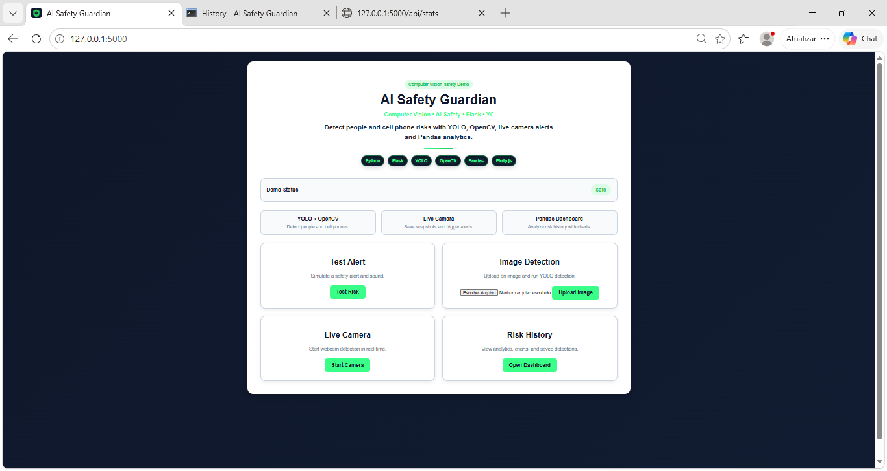
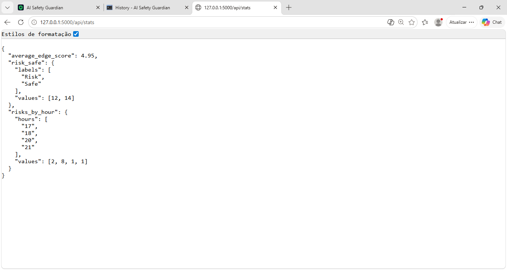

# AI Safety Guardian

AI Safety Guardian is an AI-powered computer vision web app for workplace safety monitoring.

The app uses YOLO, OpenCV, Flask, Pandas and JavaScript to detect people and cell phone risks, save snapshots, store risk history and show dashboard analytics.

## Project Goal

The goal of this project is to simulate a workplace safety monitoring system.

The system can:

- detect people in images
- detect cell phones in images
- run live camera detection
- save automatic snapshots
- save risk history in CSV
- show dashboard charts
- play alarm sounds

Simple English:

> This app checks images and live camera video.
> It detects people and cell phones.
> If it finds a cell phone in the work area, it creates a high risk alert.
> The app saves the history and shows charts.

## Technologies

- Python
- Flask
- YOLO
- OpenCV
- Pandas
- Plotly.js
- JavaScript
- HTML
- CSS
- Git and GitHub

## Main Features

### Image Detection

The user can upload an image.
The app runs YOLO detection and shows the result image with boxes.

### Live Camera Detection

The app can use the notebook webcam.
It detects people and cell phones in real time.

### Risk Alert

If the app detects a cell phone in the work area, it creates a high risk event.

### Automatic Snapshots

When the camera detects a person, the app saves a snapshot every 10 seconds.

### Risk History

The app saves detection records in a CSV file.

### Dashboard Analytics

The dashboard uses Pandas and Plotly.js to show:

- Risk vs Safe
- Average Edge Score
- Risks by Hour

## Detection Rules

Current version:

```text
Person detected -> Observation
Cell phone detected -> High Risk
No person or phone -> Safe
```

## Project Architecture

```text
backend/
  app.py          -> Flask routes and web flow
  config.py       -> project settings and file paths
  detect.py       -> YOLO and OpenCV image detection
  database.py     -> save and read risk history
  analytics.py    -> Pandas dashboard data

frontend/
  templates/      -> HTML pages
  static/         -> CSS, JavaScript and favicon

data/
  uploads/        -> uploaded images
  results/        -> processed images
  snapshots/      -> camera snapshots
```

## How To Run

### 1. Clone the repository

```bash
git clone https://github.com/ludiemert/AI_Safety_Guardian.git
cd AI_Safety_Guardian
```

### 2. Create and activate virtual environment

Windows PowerShell:

```powershell
python -m venv .venv
.\.venv\Scripts\Activate.ps1
```

### 3. Install dependencies

```powershell
pip install -r requirements.txt
```

### 4. Run the app

```powershell
python backend/app.py
```

Open in the browser:

```text
http://127.0.0.1:5000
```

## API Example

The dashboard uses this API:

```text
http://127.0.0.1:5000/api/stats
```

Example response:

```json
{
  "average_edge_score": 4.95,
  "risk_safe": {
    "labels": ["Risk", "Safe"],
    "values": [12, 14]
  },
  "risks_by_hour": {
    "hours": ["17", "18", "20", "21"],
    "values": [2, 8, 1, 1]
  }
}
```

## Screenshots

### Home Page



### Risk Dashboard


### API Stats



## What I Learned

In this project, I practiced:

- Python backend development
- Flask routes
- YOLO object detection
- OpenCV image processing
- webcam detection
- CSV data storage
- Pandas data analysis
- JavaScript fetch API
- Plotly dashboard charts
- Git and GitHub workflow
- project refactoring
- code organization by responsibility

## AI / ML Explanation

This project uses AI and Machine Learning because YOLO is a pre-trained deep learning model.

Important note:

> I did not train the model from zero in this version.
> I used a pre-trained YOLO model inside a real web application.

## Future Improvements

- PPE detection: helmet, vest and gloves
- SQLite or PostgreSQL database
- Docker
- CI/CD with GitHub Actions
- cloud deployment
- PDF reports
- more advanced risk rules

## Portfolio Summary

Built an AI-powered computer vision web app using Flask, YOLO, OpenCV and Pandas to detect people and cell phone risks, save snapshots, track incident history and display dashboard analytics.

<br/>
  <br/>

---------

#### 🤝 Contributing
If you would like to contribute to this project, feel free to open an issue or submit a pull request! 🚀
________________________________________
#### 📜 License
This project is licensed under the MIT License - see the LICENSE file for details.
👩💻 Developed with 💙 by [[LuDiemert](https://www.linkedin.com/in/lucianadiemert/)]

________________________________________
- #### My LinkedIn - [](https://www.linkedin.com/in/lucianadiemert/)

________________________________________
## 🌐 **Contact**


#### [**Luciana Diemert**](https://github.com/ludiemert)

🛠 Full-Stack Developer <br>
🖥️ Python | Computer Vision | AI Integrations <br>
📍 T23 R2RV,  Cork - Irland
☎ +353 87 243 8690

<a href="https://www.linkedin.com/in/lucianadiemert" target="_blank"></a>&nbsp;
<a href="mailto:lucianadiemert@gmail.com" target="_blank"></a>&nbsp;
<a href="#"></a>&nbsp;
<a href="https://www.github.com/ludiemert" target="_blank"></a>&nbsp;

<br clear="left"/>

---
Developed with ❤ by [ludiemert](https://github.com/ludiemert).